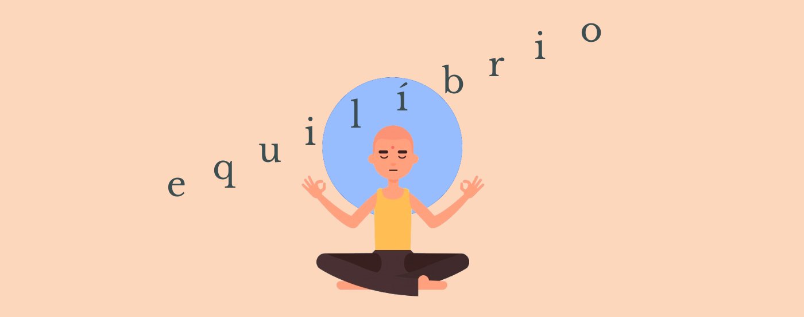
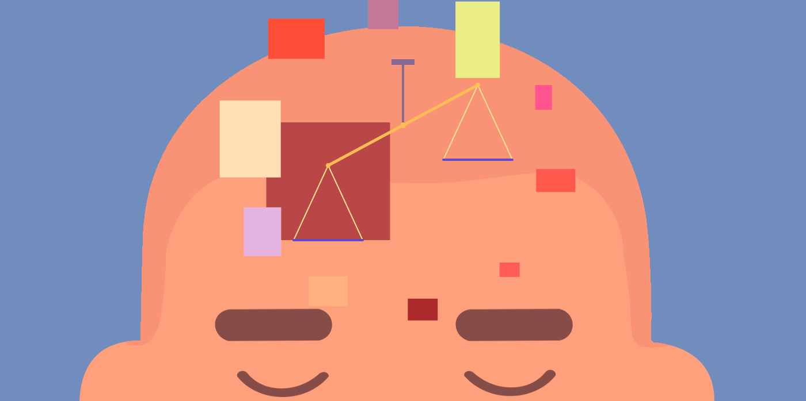

# equilíbrio (balance)

This is a short puzzle game made as Project 1 of Web Development Course at **Ironhack São Paulo**.

Help the yogi concentrate by balancing the scale in his head.

## Getting Started

To run the game, [click here](https://henricasi.github.io/equilibrio-game/). Alternatively, clone or download this project and open the index.html file in your browser.

:warning: This game is not yet compatible with mobile. You'll have to run it on a computer.

## How to play

To start the game click anywhere in the canvas. Your goal is to balance the scale with the available weights. Click a weight to add it to the scale, and click it again to remove it.

There are five stages to go through. Use your focus and balancing skills to get to the end!

## Built With

* HTML Canvas element, JavaScript and a touch of CSS
* Yogi image provided by [Freepik](www.freepik.com)
* Region detection on click taken from [Lavrton](https://lavrton.com/hit-region-detection-for-html5-canvas-and-how-to-listen-to-click-events-on-canvas-shapes-815034d7e9f8/)
* Color selection made easier with [Coolors](www.coolors.com)

## Release History

* 1.3
    * Balance stage 3 difficulty
* 1.2
    * FIX game restart bug which made every click reset the game
* 1.1
    * Add background color to page
* 1.0
    * First playable release
    * Add title screen and end screen
* 0.3
    * All stages functional
* 0.3
    * Add images
    * Change page title
    * FIX weight rendering when adding or removing weights
* 0.2
    * Add most basic functionalities
* 0.1
    * Draw canvas and objects (scale, weights)

## Contributing
Feel free to contribute in any way you want! Just fork this project, create a new branch for your features and do a pull request after commiting your changes.
 
## Planned improvements

- * Add mobile compatibilty
- * Add responsiveness
